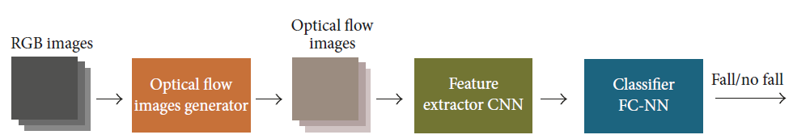

# Project Title: FALL DETECTION WITH DEEP NEURAL NETS

Develop a model to perform human activity recognition, specifically to detect falls. Falls are an important health problem worldwide 
and reliable automatic fall detection systems can play an important role to mitigate negative consequences of falls.
The automatic detection of falls has attracted considerable attention in the computer vision and pattern recognition communities. There are two neural network models in the /src folder:
1) the Fall-Detection-with-CNNs-and-Optical-Flow based on the paper: "Vision-Based Fall Detection with Convolutional Neural Networks" by Núñez-Marcos
2) I3D models based on models reported in the paper: "Quo Vadis, Action Recognition? A New Model and the Kinetics Dataset" by Joao Carreira and Andrew Zisserman

## Getting Started
These instructions will get you a copy of the project up and running on your local machine for development and testing purposes. 
See deployment for notes on how to deploy the project on a live system.
The repository contains the following files:
1. Source of downloading three Falling Datasets 
2. Dataset Pre-processing 
3. Source code for two models: a) optimal flow CNN b) I3D model
4. Results presentation. 

## Prerequisites and Installing
A step by step series of examples that tell you how to get a development env running
What things you need to install the software and how to install them:
For dataset preprocessing
```
pip install opencv-python
```
For model 1: the Fall-Detection-with-CNNs-and-Optical-Flow, check the file requirements.txt in the /scr folder for all the required dependencies
For model 2: follow the instructions for [installing Sonnet](https://github.com/deepmind/sonnet).

## Dataset description
There are three different datasets used in this project: 1)[UR Fall Detection Dataset](http://fenix.univ.rzeszow.pl/~mkepski/ds/uf.html); 2)[Kinetic Human Action Video Dataset](https://deepmind.com/research/open-source/kinetics); 3)[Multiple Cameras Fall Dataset](http://www.iro.umontreal.ca/~labimage/Dataset/).

## Dataset preprocessing
### sliding window
XXXX hongyu write here about the sliding window

Optical flow images represent the motion of two consecutive frames, which is too short-timed to detect a fall. However, stacking a set of them 
the network can also learn longer time-related features. These features were used as input of a classifier, a fully connected neural network (FCNN), which outputs 
a signal of “fall” or “no fall.” The full pipeline can be seen in Figure 1. Finally, we used a three-step

### Optical flow images generator
The optical flow algorithm represents the patterns of the motion of objects as displacement vector fields between two consecutive images

## Model Description
The following figure shows the system architecture or pipeline: the RGB images are converted to optical flow images, then features are extracted with a CNN,
and a FC-NN decides whether there has been a fall or not.



## Running the tests

Explain how to run the automated tests for this system

### Break down into end to end tests

Explain what these tests test and why

```
Give an example
```


 <!-- .element height="50%" width="50%" -->
 <!-- .element height="50%" width="50%" -->
<!-- .element height="50%" width="50%" -->

### And coding style tests

Explain what these tests test and why

```
Give an example
```

## Inflated 3D Conv Net: Results

### A. First Results (Possible Overlap in Train/Test Sets, See Addendum)

__Data__: RGB clips of 20 frames.

|       | Fall  | No Fall |
| :---  | :---  | :---    |
| Train |  40   |  200    |
| Test  |  18   |  15     |

__Results__: 

- *Accuracy*: 94%
- *Precision*: 1.00
- *Recall*: 0.89


### B. Updated Results (No Overlap between Train/Test Sets, See Addendum)

__Data__: RGB clips of 20 frames.

|       | Fall  | No Fall |
| :---  | :---  | :---    |
| Train |  47   |  159    |
| Test  |  11   |  56     |

__Results__: 

- *Accuracy*: 94%
- *Precision*: 0.82
- *Recall*: 0.82


## Authors

* **Hongyu Shen** 
* **William Wei** 
* **Asad Khan** 
* **Shirui Luo** 
* **Madhu Vellakal** 

## License

This project is licensed under the MIT License - see the [LICENSE.md](LICENSE.md) file for details

## Acknowledgments

* Hat tip to anyone whose code was used
* Inspiration
* etc

