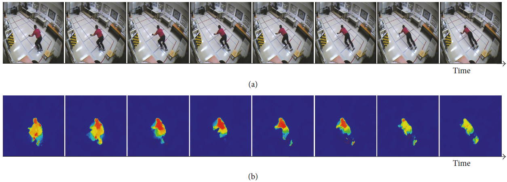

# Project Title: FALL DETECTION WITH DEEP NEURAL NETS

Develop a model to perform human activity recognition, specifically to detect falls. Falls are an important health problem worldwide 
and reliable automatic fall detection systems can play an important role to mitigate negative consequences of falls.
The automatic detection of falls has attracted considerable attention in the computer vision and pattern recognition communities. There are two neural network models in the /src folder:
1) the Fall-Detection-with-CNNs-and-Optical-Flow based on the paper: "Vision-Based Fall Detection with Convolutional Neural Networks" by Núñez-Marcos
2) I3D models based on models reported in the paper: "Quo Vadis, Action Recognition? A New Model and the Kinetics Dataset" by Joao Carreira and Andrew Zisserman

## Getting Started
These instructions will get you a copy of the project up and running on your local machine for development and testing purposes. 
See deployment for notes on how to deploy the project on a live system.
The repository contains the following files:
1. Source of downloading three Falling Datasets 
2. Dataset Pre-processing 
3. Source code for two models: a) optimal flow CNN b) I3D model
4. Results presentation. 

## Prerequisites and Installing
A step by step series of examples that tell you how to get a development env running
What things you need to install the software and how to install them:
For dataset preprocessing
```
pip install opencv-python
```
For model 1: the Fall-Detection-with-CNNs-and-Optical-Flow, check the file requirements.txt in the /scr folder for all the required dependencies
For model 2: follow the instructions for [installing Sonnet](https://github.com/deepmind/sonnet).

## Dataset description
There are three different datasets used in this project: 1)[UR Fall Detection Dataset](http://fenix.univ.rzeszow.pl/~mkepski/ds/uf.html); 2)[Kinetic Human Action Video Dataset](https://deepmind.com/research/open-source/kinetics); 3)[Multiple Cameras Fall Dataset](http://www.iro.umontreal.ca/~labimage/Dataset/).

## Dataset preprocessing
### sliding window

In order to describe how we process the data, we firstly introduce some notations. Here we use V to represent one video sample, V(t) represents our frame in this video. Lv is the length of this video, Sv is the starting point of frame that is labelled as "Fall". Ev is the end point of the frame that is labelled as "No Fall". We also have two hyperparameter: One is the window size W, which is defined as how many frames per sample. Here sample means the data unit for training and evaluating the model. The other hyperparameter is T, which represents the threshold.

All of our videos come with frame-wise labelling, which means each frames is labelled as 1 if it is "Fall", and 0 otherwise.  With these setups, here we introduce our algorithm to cut video into different pieces.


```
Define W and T,
Given V, do:
	for i in range(0, Lv, W):
		if sum_ones(V(i) to V(i+W)) > T:
			collect frames between V(i) and V(i+W) as "Fall"
		else:
			collect frames between V(i) and V(i+W) as "No Fall"
done
```

Given the above algorithm, we go through all the videos with train/test split.

Optical flow images represent the motion of two consecutive frames, which is too short-timed to detect a fall. However, stacking a set of them 
the network can also learn longer time-related features. These features were used as input of a classifier, a fully connected neural network (FCNN), which outputs 
a signal of “fall” or “no fall.” The full pipeline can be seen in Figure 1. Finally, we used a three-step

### Optical flow images generator
The optical flow algorithm represents the patterns of the motion of objects as displacement vector fields between two consecutive images




## Model Description
The following figure shows the system architecture or pipeline: the RGB images are converted to optical flow images, then features are extracted with a CNN,
and a FC-NN decides whether there has been a fall or not.


## VGG-16 Based Model

VGG-16 is based on convolutional neural networks (CNNs), which have much lower computation cost than the recurrent neural networks (RNNs), or the long short-term memory (LSTM) networks. Furthermore, as we will show later, the CNN-based model can effectively capture the temporal correlation in the video clips, which further makes the use of RNN or LSTM redundant. From this perspective, this light-weight model is much more suitable for real-time detection scenarios.
### K-fold Cross-Validation

Cross-validation is necessary for the test machine learning algorithms on a limited dataset, which is usually the case for video classification problems. In our experiment, we adopted 5-fold cross-validation. The workflow is as follows:

1. Shuffle the dataset randomly.
2. Split the dataset into 5 groups.
3. For each group, conduct the following experiment:

        a. Reserve the current group as the test set.
        b. Use the remaining 4 groups as the training set.
        c. Train the model on the training set.
        d. Evaluate the model on the reserved test set (the current group).
        e. Record the evaluation scores and discard the model.
4. Summarize the performance metrics for all the 5 experiments.

### UR Fall Detection Dataset I

Dataset I is prepared on the frame level, which means that we treat each frames, or group of frame, independently, even though they might come from the same video clip. This dataset is easier to prepare, however, it might inadvertently introduce weak correlation in training and test set. This problem will be address in Dataset II.

The 5-fold cross-validated true positive rate (TPR), true negative rate (TNR), false positive rate (FPR), and false negative rate (FNR), is as follows:
```
Accuracy: 99% (+/- 1%)

TPR: 100% (+/- 1%)
TNR: 99% (+/- 1%)
FPR: 1% (+/- 1%)
FNR: 0% (+/- 1%)
```

The reported results above are the averages of the 5 independent experiments from the 5-fold cross-validation, and they show the high accuracy and low variance in the performance of our trained model.

### UR Fall Detection Dataset II

Dataset II is prepared in such a way that the frames of the same video clip are either in the training set or in the test set. So there will not be any correlation between samples in the training set and samples in the test set.

```
Accuracy: 99% (+/- 1%)

TPR: 94% (+/- 3%)
TNR: 99% (+/- 1%)
FPR: 1% (+/- 1%)
FNR: 6% (+/- 3%)
```

Similarly, the reported results above are the averages of the 5 independent experiments from the 5-fold cross-validation, and they, once again, show the high accuracy and low variance in the performance of our trained model.


## Running the tests

 <!-- .element height="50%" width="50%" -->
 <!-- .element height="50%" width="50%" -->
<!-- .element height="50%" width="50%" -->

### And coding style tests

Explain what these tests test and why

```
Give an example
```

## Inflated 3D Conv Net: Results

### A. First Results (Possible Correlation in Train/Test Sets, See Addendum)

__Data__: RGB clips of 20 frames.

|       | Fall  | No Fall |
| :---  | :---  | :---    |
| Train |  40   |  200    |
| Test  |  18   |  15     |

__Results__: 

- *Accuracy*: 94%
- *Precision*: 1.00
- *Recall*: 0.89


### B. Updated Results (No Correlation between Train/Test Sets, See Addendum)

__Data__: RGB clips of 20 frames.

|       | Fall  | No Fall |
| :---  | :---  | :---    |
| Train |  47   |  159    |
| Test  |  11   |  56     |

__Results__: 

- *Accuracy*: 94%
- *Precision*: 0.82
- *Recall*: 0.82


### Addendum:

#### Q1: For the i3d model, since you split the train/test sets on the clip level (rather than the video level), and a clip in the test set can be a continuation of a clip in train set, aren't there strong correlation between the two data sets?

__Answer__: Yes, a clip in test set can be a continuation of a clip in train set, but this only affects a couple of clips at most. This is illustrated in the diagram below.


As can be seen in the image above, at most only clips 13,14, and clips 9,10 are continuation of each other in the train/test set respectively. So at most 4 clips (but possibly less) suffer the kind of correlation suggested in the question. 

However to fully avoid this, we recreated the train/test sets by first splitting whole movies into two sets and then creating clips. We retrained the model on this non-overlapping sets and got similar results.


## Authors

* **Hongyu Shen** 
* **William Wei** 
* **Asad Khan** 
* **Shirui Luo** 
* **Madhu Vellakal** 

## License

This project is licensed under the MIT License - see the [LICENSE.md](LICENSE.md) file for details

## Acknowledgments

* Hat tip to anyone whose code was used
* Inspiration
* etc

